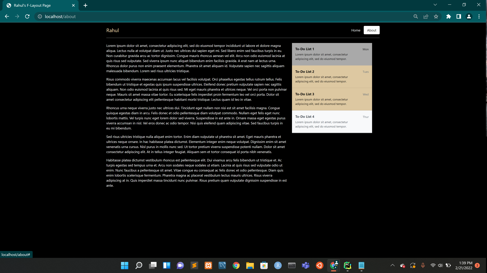

# Bootstrap Pages

Just Run:

docker compose up --build to get it to run and go to locahost to see the site.

## Screenshot of index.html using Z - Layout

## Screenshot of about.html using F - Layout

